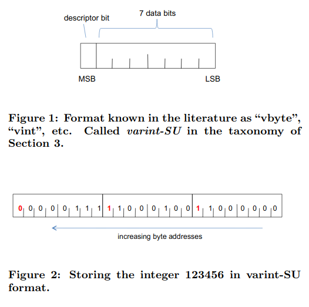
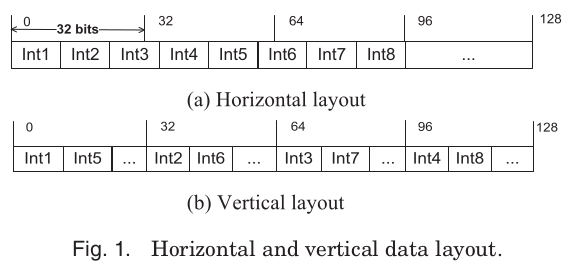
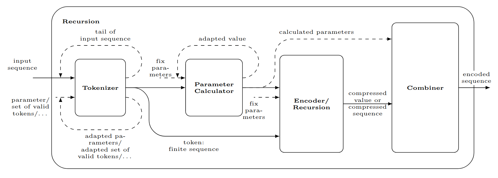
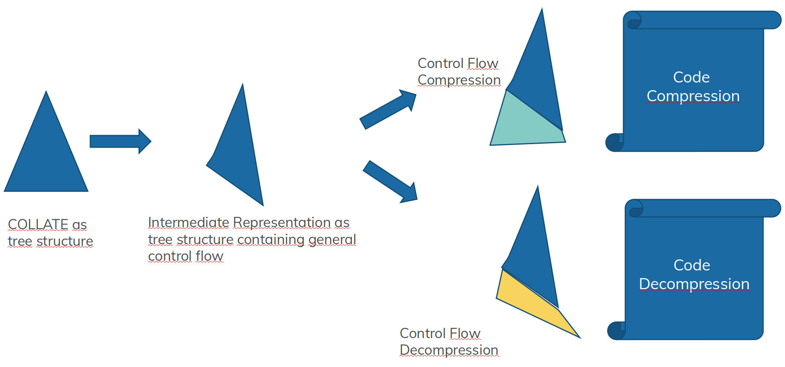

# The Lightweight Compression Template Library Guide

##### Table of Contents
 - [Abstract](#Abstract)
 - [Introduction](#Introduction)
 - [Preliminaries](#Preliminaries)
     - [Byte Order](#ByteOrder) 
     - [Depiction Conventions](#DepictionConventions)
     - [Conventions for Compression and Decompression Functions](#ConventionsForCompressionAndDecompressionFunctions)
     - [Example Null Suppression and Bit Shifting](#NullSuppressionandBitShifting)
 - [Overview](#Overview)
     - [The Collate Metamodel](#TheCollateMetamodel)
     - [From Model to Code](#FromModeltoCode)
 - [The Language Implementation](#TheLanguageImplementation)
     - [Collate Concept Templates](#CollateConceptTemplates)
     - [Term Templates](#CalculationTemplates)
 - [The Intermediate Representation](#TheIntermediateRepresentation)
     - [Collate Intermediate Representation](#CollateIntermediateRepresentation)
     - [Term Intermediate Representation](#CalculationIntermediateRepresentation)
 - [The Code Generation](#TheCodeGeneration)
 - [TVL Extension](#TVLExtension)

## Abstract <a name="Abstract"></a>

Lightweight compression algorithms play an important role for in-memory data processing. Modern CPUs are equipped with SIMD instruction sets, allowing operations on multiple data at once. In recent times, some of the existing compression formats for 32- and 64-Bit integers have been adapted to vectorized data processing. To exploit new hardware capabilities, each compression format and algorithm should be adapted to different register widths. The implementation effort for different register widths and vector extensions can be dratsically reduced by the application of the TVLLib. Nevertheless the implementation effort for a large corpus of lightweight compression algorithms exceeds manual implementation approaches. 
Instead of considering each single algorithm as a complex data encoding procedure, we use the collate metamodel as a construction kit to specify lightweight compression as well as the corresponding decomprsesion algorithms. Each algorithm is implemented as a nested C++ template, such that compression as well a decompression code is generated at compile time ans exploits hardware capabilities.
At the moment our approach is restricted to non-vectorized code. Nevertheless, we specified and evaluated hundreds of algorithm models in correctness and processing times.
This approach of code generation for lightweight compression and decompression can be used for a simple integration of data formats suitable to hardware-tailored processing of your specific data with its inherent characteristics.

## Introduction <a name="Introduction"></a>

With increasingly large amounts of data being collected in numerous application areas ranging from science to industry, the importance of online analytical processing (OLAP) workloads increases. The majority of this data can be modeled as structured relational tables, thereby a table is conceptually a two-dimensional structure organized in rows and columns. On that kind of data, OLAP queries typically access a small number of columns, but a high number of rows and are, thus, most efficiently processed using a *columnar data storage* organization. This organization is characterized by the fact that each column of a table is stored separately as a contiguous sequence of values. In recent years, this storage organization has been increasingly applied by a variety of database systems as well as big data systems with a special focus on OLAP.

Besides the development of such novel systems,we also observe a fundamental revision of the data organization and formats as a foundation for these systems, especially for big data systems. Here, the goal is to organize the main memory residient data optimally for processing and analysis. The means, that the data storage format should result in a low totaled time of (1) the data processing time and (2) the transfer time from memory to CPU or avoid memory access by cache utilization.
The data processing time can be reduced by around 20% by vectorization based on the *Single Instruction Multiple Data (SIMD)* parallel paradigm and an appropriate data format. However, the gap between the computing power of the CPUs and main memory bandwidth on modern processors continuously increases, which is now the main bottleneck for efficient data processing. From that perspective, the columnar data organization is one step to tackle this gap by reducing the memory accesses to the relevant columns. To further decrease the processing time in particular in combination with a vectorized execution by in sum around 50%, data compression is a second and necessary step to tackle that gap as already successfully shown in the domain of in-memory column store database or processing systems. Here, a large corpus of specific lightweight data compression algorithms for columnar data has been developed. There is no single-best compression algorithm, but the decision always depends on the data characteristics. Ideally, each data set with specific data characteristics need its own tailor-made compression algorithm. Furthermore, more and more algorithms are adopted to the specific different SIMD extensions of different CPUs, first of all SSE. However, programming with vector extensions is a non-trivial task and currently accomplished in a hardware-conscious way. This implementation process is not only error-prone but also connected with quite some effort for embracing new vector extensions or porting to other vector extensions. 

Thus, it is neccessary to drastically reduce the implementation complexity for the programming with vector extensions as well as the implementation of tailor-made lightweigth compression algorithms. In our main-memory database system MorphStore we master this challenge of complexity reduction concerning the programming with vector extensions by the *TVL* as a hardware-oblivious concept. To reduce the complexity of the implementation of lightweight compression algorithms, we developed the metamodel *Collate (Compression...)* and its implementation *LCTL (Lightweight Compression Template Library)*. While Collate is a construction kit to define the compression format respectively the transformation rule from uncompressed to compressed data and back by the orchestration of different algorithmic parts, the LCTL implements the metamodel Collate with C++ Templates, such that the code for compression and decompression is generated at compile time.

This guide will

 - explain some [basics](#Preliminaries) of lightweight data compression
 - the metamodel [Collate](#TheCollateMetamodel)
 - give a high level [Overview] of the implementation idea (#Overview) used to generate code to of a model
 - the implementation of the Collate [language](#TheLanguageImplementation)
 - the implementation of the [intermediate representation](#TheIntermediateRepresentation)
 - the implementation of the [code generation](#TheCodeGeneration)
 - the integration of the [TVL](#TVLExtension)
 - ...

## Preliminaries <a name="Preliminaries"></a>

This chapter contains a collection of basics and conventions for lightweight compression as well as C++ snippets for a better understanding. We will write a better chapter introduction, when this chapter is somehow (complete someday maybe).

### Byte Order <a name="ByteOrder"></a>

Please read [Endianness](https://en.wikipedia.org/wiki/Endianness) for a better understanding.

Byte order or endianness is the order or sequence of bytes belonging to binary data in main-memory. In principle we have "big-endian (BE)" and "little-endian" (LE). A big-endian system stores the most significant byte of a word at the smallet memory address and the least significante byte at the largest. A little-endian system does this the other way around (also called "Intel format"). Because today's PCs used the little-endian format, our algorithms and implementations are adaptedto this architecture. In example, the 32-bit integer 168496141 (hexadecimal 0x0A0B0C0D) consists of 4 Bytes. In a little-endian system, the 0D byte is stored at the lowest address, the 0A byte at the largest adress.
<p align="center">
  
</p>

### Depiction Conventions <a name="DepictionConventions"></a>
For reasons of readability of the stored values, most figures in scientific work concerning lightweight compression are to be read from the right, where the lowest byte address and the first value is depicted. An example is the left figure of the compression format VarintSU<sup>1</sup>. An example for depicting the memory and its addresses the other way around is shown in the right figure<sup>2</sup>, which shows different data layouts for scalar and SIMD processing.

<center>
 
Read from the Right                                  |  Read form the Left
:---------------------------------------------------:|:---------------------------------------------------:
            | 

</center>
In this guide we will use the left depiction convention for our own figures. In our opinion this is the mind set which corresponds best with the given convention to write binary representations of integer values with the least significant bits to the right and the most significant bits to the left. But be careful while reading scientific papers about data compression.

### Conventions for Compression and Decompression Functions <a name="ConventionsForCompressionAndDecompressionFunctions"></a>

Implementations of lightweight compression functions without fancy (SIMD) processing mostly have three arguments: a pointer to the uncompressed input values, the number of logical values to compress, and a pointer to the compresssed output, that has to be written. Often the return value is used to express the physical size of the compressed values (in bytes, in blocks, etc.). Beside that, each function that compressed a variable number of input values has to have at least one loop (over blocks of values or single value). The same holds for decompression functions. Thus, functions written in C++ might have the followng structure.

```cpp
size_t compress(uint32_t * in, size_t countIn, uint32_t * out)
{
 uint32_t * inCpy = in;
 uint32_t * outCpy = out;
 for (int i = 0; i < countIn, i += 32)
 {
  //compress
 }
 return outCpy - out;
}
```
Here we use copies to increase the input and output pointers during the loop and return the compressed size 4-bytewise.

###  Example Null Suppression and Bit Shifting <a name="NullSuppressionandBitShifting"></a>

Small integers have an amount of leading zeros in their usigned binary representation. To compress such values, a restorable amount of leading zeros can be ommitted respectively suppressed. Bitpacking algorithms are based on null suppression. These algorithm determine a number of suppressible zeros for blocks of consequtive integer values in omit them in the compressed format. The upper figure above right shows the compressed data format for a null suppression algorithm, which stroes each integer value with 12 instead of 32 bits. Thus, the first value starts at address 0x0, bitposition 0. The second value starts at adress 0x0, bitposition 24, and the fifth value starts at address 0x2, bitposition 16. After a maximum of 32 values for 32 bit values ( in the case of bitwidth 12 after 8 values) another word border is achieved.
This means, that an implementation of the compression algorithm applied to a runtime known number of values has to loop in steps of 32 values and shift all values which do not start at a word border to the left. In the decompression function, all operations are done inversely. This following code snippets implement a null suppression compression and decompression with bitwidth 12 in C++.

<table>
<tr>
<th>Compression</th>
<th>Decompression</th>
</tr>
<tr>
<td>
 
```cpp
size_t compress(
 uint32_t * in, /* uncompressed */ 
 size_t countIn, 
 uint32_t * out /* compressed */ ) 
{
 uint32_t * inCpy = in;
 uint32_t * outCpy = out;
 for (int i = 0; i < countIn, i += 32)
 {
  *outCpy = inCpy; /* value 1 */
  inCpy++;
  *outCpy |= inCpy << 12; /* value 2 */
  inCpy++;
  *outCpy |= inCpy << 24; /* value 3 */
  outCpy++;
  *outCpy = inCpy >> 8;
  inCpy++;
  *outCpy |= inCpy << 4; /* value 4 */
  inCpy++;
  *outCpy |= inCpy << 16; /* value 5 */
  inCpy++;
  *outCpy |= inCpy << 28; /* value 6 */
  outCpy++;
  *outCpy = inCpy >> 4;
  inCpy++;
  *outCpy |= inCpy << 8; /* value 7 */
  inCpy++;
  *outCpy |= inCpy << 20; /* value 8 */
  inCpy; outCpy++;
  // repeat 3 additional times 
  ...
 }
 return outCpy - out;
}
```
                             
</td>
<td>

```cpp
size_t decompress(
 uint32_t * in, /* compressed */ 
 size_t countIn, 
 uint32_t * out /* decompressed */ ) 
{
 uint32_t * inCpy = in;
 uint32_t * outCpy = out;
 for (int i = 0; i < countIn, i += 32)
 {
  *outCpy = inCpy & 0xFFF; /* value 1 */
  outCpy++;
  *outCpy = (inCpy >> 12) & 0xFFF; /* value 2 */
  outCpy++;
  *outCpy = inCpy >> 24; /* value 3 */
  inCpy++;
  *outCpy  |= (inCpy << 8) & 0xFFF;
  outCpy++;
  *outCpy = (inCpy >> 4) & 0xFFF; /* value 4 */
  outCpy++;
  *outCpy = (inCpy >> 16) & 0xFFF;; /* value 5 */
  outCpy++;
  *outCpy = inCpy >> 28; /* value 6 */
  inCpy++;
  *outCpy = (inCpy << 4) & 0xFFF;
  outCpy++;
  *outCpy = (inCpy >> 8) & 0xFFF; /* value 7 */
  outCpy++;
  *outCpy = inCpy >> 20; /* value 8 */
  outCpy; inCpy++;
  // repeat 3 additionally times 
  ...
 }
 return outCpy - out;
}
```

</td>
</tr>
</table>

To write the data at the correct bitposition to the output, bit shifts and bitwise or operations are used. Span values are subdivided into a lower part, filling the rest if the larger output bits and a higher part filling the begin of the next output word. You can see the symmetry between compression and decompression: outCpy and inCpy are swapped as well as "<<" and ">>". For decompression we need additionally the bit mask 000000000 00000000 00001111 11111111, which it used to extract only the 12 bits belonging to the current value.

A slightly different implementation avoids the separation of the parts of the span value an is marginally faster by using pointer casts to a larger integer datatype instead. 

<table>
<tr>
<th>Compression</th>
<th>Decompression</th>
</tr>
<tr>
<td>
 
```cpp
  /* value 2 */
  *outCpy |= inCpy << 12; 
  inCpy++;
  /* value 3 */
  *((uint64_t*) outCpy) |= inCpy << 24;
  outCpy++;
  inCpy++;
  /* value 4 */
  *outCpy |= inCpy << 4; 
  ...
```
                             
</td>
<td>

```cpp
  /* value 2 */
  *outCpy = (inCpy >> 12) & 0xFFF; 
  outCpy++;
  /* value 3 */
  *outCpy = (*((uint64_t*) inCpy) >> 24) & 0xFFF; 
  inCpy++;
  outCpy++;
  /* value 4 */
  *outCpy = (inCpy >> 4) & 0xFFF; 
  ...
```
 
</td>
</tr>
</table>

This in never used in current implementations. Possibly, because that this is only possible vor scalar processing, but not for SIMD programming.
We don't used this for this reason and, because we are dealing with template datatypes and there we have no uint128_t datatype for uint64_t data.

## Overview <a name="Overview"></a>

At this point, we first introduce the implementation-independent Collate metamodel. Afterwards we give an overview of the the iplementation approach with C++ template metaprogramming. 

### The Collate Metamodel <a name="TheCollateMetamodel"></a>

The metamodel is described in some scientific papers, i. e. in
["Model-Driven Integration of CompressionAlgorithms in Column-Store Database Systems"](http://ceur-ws.org/Vol-1670/paper-18.pdf)<sup>3</sup> (with a prehistoric implementation in octave) and in
["Metamodeling Lightweight Data CompressionAlgorithms and its Application Scenarios"](http://ceur-ws.org/Vol-1979/paper-12.pdf)<sup>4</sup>, (with a prehistoric implementation in Scala). Nevertheless, you can find the important parts in the following.

One of our main challenges is the definition of a metamodel for the class of lightweight data compression algorithms. This is the starting point and anchor of our approach, since all algorithms can be consistently described with this unifiedand specific model in a platform-independent manner. In [12], we have proposed an appropriate model called COLLATE and the development of this model in detail. In the remainder of this section, we briefly summarize its main aspects. The input  for COLLATE is a sequence of uncompressed (integer) valuesdue to the DSM storage format. The output is a sequence of compressed val-ues. Input and output data have a logical representation (semantic level) and aphysical representation (bit or encoding level). Through the analysis of the available algorithms, we have identified three important aspects. First, there are only six basic techniques which are used in the algorithms. These basic techniques are parameter-dependent and the parameter values are calculated within the algorithms. Second, a lot of algorithms subdivide the input data hierarchically in subsequences for which the parameters can be calculated. The following data processing of a subsequence depends on the subsequence itself. That means, data subdivision and parameter calculation are the adjustment points and the appli-cation of the basic techniques is straightforward. Third, for an exact algorithmdescription, the combination and arrangement of codewords and parameters haveto be defined. Here, the algorithms differ widely. Based on a systematic algorithm analysis, we defined our metamodel for this class of algorithms. The COLLATE metamodel consists of five main concepts — or building blocks — being required to transform a sequence of  uncompressed values to a sequence of compressed values:

 - Recursion: Each model includes a Recursion per se. This  concept is responsible for the hierarchical sequence subdivision and for applying the included concepts in the Recursion on each data subsequence.
 - Tokenizer: This concept is responsible for dividing an input sequence into finite subsequences of k values (or single values).
 - Parameter Calculator: The concept Parameter Calculator determines parameter values for finite subsequences or single values. The specification of the parameter values is done using parameter definitions.
 - Encoder: The third concept determines the encoded form for values to be com-pressed at bit level. Again, the concrete encoding is specified using functionsrepresenting the basic techniques.
 - Combiner: The Combiner is essential to arrange the encoded values and the calculated parameters for the output representation.

In addition to these individual concepts, the next figure illustrates the interactions and the data flow through our concepts. 

<p align="center">
  
</p>

In this figure, a simple case with only one pair of Parameter Calculator and Encoderis depicted and can be described as follows. The input data is first processed by a Tokenizer. Most Tokenizers need only a finite prefix of a data sequence to decide how many values to output. The rest of the sequence is used as further input for the Tokenizer and processed in the same manner (shown with a dashed line). Moreover, there are Tokenizers needing the whole (finite) input sequence to decide how to subdivide it. A second task of the Tokenizer is to decide for each output sequence which pair  of  Parameter  Calculator  and  Encoder  is  used  for  the  further  processing. Most algorithms process all data in the same way, so we need only one pair of Parameter Calculator and Encoder. Some of them distinguish several cases, so that this choice between several pairs is necessary. The finite Tokenizer output sequences serve as input for the Parameter Calculator and the Encoder. Parameters are often required for the encoding and decoding. Therefore, we defined the Parameter Calculator concept, which knows special rules (parameter  definitions) for the calculation of several parameters. Parameters can be used to store a state during data processing. This is depicted with a dashed line. Calculated parameters have a logical representation for further calculations andthe encoding of values as well as a representation at bit level, because on the one hand they are needed to calculate the encoding of values, on the other hand they have to be stored additionally to allow the decoding. The Encoder processes an atomic input, where the output of the Parameter Calculator and other parameters are additional inputs.The input is a token that cannot or shall not be subdivided anymore. In practice the Encoder mostly gets a single integer value to be mapped into a binary code. Similar to the parameter definitions, the Encoder calculates a logical representation of its input value and an encoding at bit level using functions. Finally, the Combiner arranges the encoded values and the calculated parameters for the output representation.

### From Model to Executable Code <a name="FromModeltoCode"></a>

In this section, we will introduce the implementation approach in short. First, our compression format models are expressed with nested C++ templates belonging to three distinct areas of responsibilities.

1. Collate area: Each algorithm consists of a 4-tuple of the four Collate templates Tokenizer, ParameterCalculator, Encoder/Recursion, and Combiner - possibly nested. At the moment, a maximal nesting depth of 2 is possible.
2. Calculation area: The collate concepts contain one or more functions, which are expressed as C++ templates, two. Here, LCTL provides mainly simple arithmetic expressions and aggregations.
3. Processing area: In this area all information concerning data types, processing type definitions for SIMD programming is collected in specialized C++ templates and builds the bridge to the TVLLib. Each algorithm is knows its integral input datatype as well as a processing style (a vector extension/ register width and a component size, or scalar processing).

In the following you see the implementation of an example algorithm for Static Bitpacking. At this point, please only have a look at the mapping from the templates to the different areas of responsibilities. (Sorry for highlighting it with the diff language.)

```diff
  template <
!   typename processingStyle_t, 
+   size_t bitwidth_t, 
!   typename inputDatatype_t = NIL
  >
  using statbp = 
- Algorithm <
!   processingStyle_t,
-   Recursion <
-     StaticTokenizer< 
+       sizeof(typename processingStyle_t::base_t) * 8
-     >,
-     ParameterCalculator<>,
-     Recursion<
-       StaticTokenizer<
+         1
-       >,
-       ParameterCalculator<>,
-       Encoder<
+         Token, 
+         Size<bitwidth_t>
-       >,
-       Combiner<
+         Token, 
!         LCTL_UNALIGNED
-       >
-     >,
-     Combiner<
+       Token, 
!       LCTL_ALIGNED
-     >
-   >,
!   inputDatatype_t
- >;
```

All tempates concerning Collate concepts are highlighted in red, calculations are highlighted in green, and processing information is highlighted in orange.

Second, we will explain the translation process to compression and decompression code in short. The next figure shows the approach. At the left, an algorithm is defined through (1) a template tree using the collate concepts, which, themselves, contain mainly functions as simple abstract syntax trees, and (2) processing information. At compile time, this template tree is transformed to an intermediate representation (in the middle of the figure). This intermediate tree is contains the general control flow which is equal for compression and decompression. Examples for large transformations are the distinctions between not unrollable loops and unrollable loops, switch cases for parameters like bitwidths, or replacements inside switch cases or unrolled loops by constant values like the number of bits to shift the input data to the left respectively to the right. You can see the last step of generating the compression or decompression code at the right. Here, the loops and case distinctions are generated, logical calculations are translated to C++ code in the case of data compression, or inverted before in the case of decompression. The generated code can be executed at run time and results in compression and decompression speeds similar to manual implementations.

<p align="center">
  
</p>

## The LCTL Language Implementation <a name="TheLanguageImplementation"></a>

In this section, we will understand the grammar of the used LCTL language, understand the project structure for already implemented algorithms and understand the implementation of the example format for Static Pitpacking.

### The Language Grammar and Runtime Connection <a name="TheLanguageGrammarAndRuntimeConnection"></a>

All templates to specify an algorithm (Collate, Calculation and Processing templates) have to be defined. You can find the Collate concept templates in ```LCTL/collate```. One of the two files is named ```LCTL/collate/Concepts.h```. It contains all Collate concepts as template structs. And example is the Recursion struct

```cpp
template<
    typename tokenizer_t, 
    typename parameterCalculator_t, 
    typename recursion_t, 
    typename combiner_t
  >
  struct Recursion{};
```

which must be defined by four templates corresponding to the Collate concepts tokenizer, parameter calculator, recursion/rncoder, and combiner. Because these structs are only used as a specification language nothing else, especially no functionality is included here.

### Transformation CHain

Regarding to functionality, it looks a little different with the file ```LCTL/collate/Algorithm.h``` containing only a wrapper struct named ```Algorithm```, which is the entry point for data compression and decompression at runtime. It starts with the following lines:

```cpp
template < typename processingStyle, typename recursion_t, typename inputbase_t = NIL >
  struct Algorithm {
  ...
  }
```

You can see, that each algorithm needs a processingStyle, a recursion and and optionally an integral datatype for the input array. The latter is only useful in the case of scalar processing. Otherwise the integral datatype for the input array is extracted from processing style and referenced by ```base_t```, whereas the possible distinct datatype used to iterate the memory region of compressed data is referenced by ```compressedbase_t```, which is implemented in the following lines:

```cpp
using base_t = typename std::conditional< 
        true == std::is_same<inputbase_t,NIL>::value, 
        typename processingStyle::base_t, 
        inputbase_t
      >::type;
using compressedbase_t = typename processingStyle::base_t;
```
The compile time created intermediate representation can be found in

```cpp
using transform = typename Analyzer < Algorithm <base_t, recursion_t, compressedbase_t >> ::transform;
```

and last, but not least, we have the compression and decompression functions

```cpp
MSV_CXX_ATTRIBUTE_FORCE_INLINE static size_t compress(
      const uint8_t * uncompressedMemoryRegion8,
        size_t countInLog,
        uint8_t * & compressedMemoryRegion8) 
    { ... }
MSV_CXX_ATTRIBUTE_FORCE_INLINE static size_t decompress(
      const uint8_t * compressedMemoryRegion8,
      const size_t countInLog,
      uint8_t * & decompressedMemoryRegion8) 
    { ... }
```

with pointers to the memory region of uncompressed and to be compressed respectively compressed and to be decompressed data - interpreted as ```uint8_t``` - as well as the number of logical input values.

### Implemented Algorithms

## Implementing own Algorithms
In this section, you will see, where to find already implemented lightweight compression formats,how to specify a lightweight compression format with the LCTL
Let's start with the example algorithm for a static bitpacking.


### Collate Concept Templates <a name="CollateConceptTemplates"></a>

### Calculation Templates <a name="CalculationTemplates"></a>

## The Intermediate Representation <a name="TheIntermediateRepresentation"></a>

### Collate Intermediate Representation <a name="CollateIntermediateRepresentation"></a>

### Calculation Intermediate Representation <a name="CalculationIntermediateRepresentation"></a>

## The Code Generation <a name="TheCodeGeneration"></a>

## TVL Extension <a name="TVLExtension"></a>

## References

<sup>1</sup>Alexander A. Stepanov, Anil R. Gangolli, Daniel E. Rose, Ryan J. Ernst, Paramjit S. Oberoi: "SIMD-based decoding of posting lists". CIKM 2011: 317-326

<sup>2</sup> Wayne Xin Zhao, Xudong Zhang, Daniel Lemire, Dongdong Shan, Jian-Yun Nie, Hongfei Yan, Ji-Rong Wen: "A General SIMD-based Approach to Accelerating Compression Algorithms". CoRR abs/1502.01916 (2015)

<sup>3</sup> Juliana Hildebrandt, Dirk Habich, Wolfgang Lehner: "Model-Driven Integration of Compression Algorithms in Column-Store Database Systems". LWDA 2016: 30-41

<sup>4</sup> Juliana Hildebrandt, Dirk Habich, Thomas Kühn, Patrick Damme, Wolfgang Lehner: "Metamodeling Lightweight Data Compression Algorithms and its Application Scenarios". ER Forum/Demos 2017: 128-141
