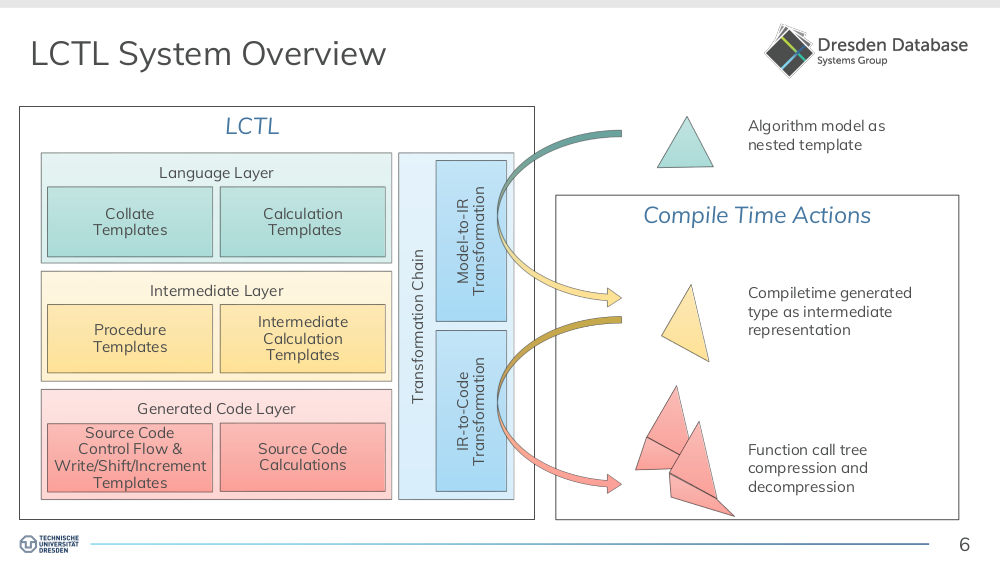
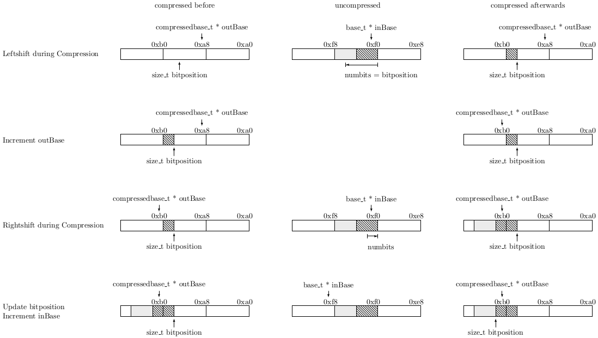

# The Lightweight Compression Template Library Guide

##### Table of Contents
 - [Abstract](#Abstract)
 - [Introduction](#Introduction)
 - [Preliminaries](#Preliminaries)
     - [Byte Order](#ByteOrder) 
     - [Depiction Conventions](#DepictionConventions)
     - [Conventions for Compression and Decompression Functions](#ConventionsForCompressionAndDecompressionFunctions)
     - [Example Null Suppression and Bit Shifting](#NullSuppressionandBitShifting)
 - [Overview](#Overview)
     - [The Collate Metamodel](#TheCollateMetamodel)
     - [The Lightweight Compression Template Library](#TheLightweightCompressionTemplateLibrary)
 - [The Language Layer](#TheLanguageLayer)
     - [The Collate Templates](#TheCollateTemplates)  
     - [The Calculation Templates](#TheCalculationTemplates)
     - [Algorithm Specification Static Bitpacking](#AlgorithmSpecificationStaticBitpacking)
 - [The Intermediate Layer](#TheIntermediateLayer)
     - [Procedure Templates](#ProcedureTemplates) 
         - [Known and Unknown Parameter Values](#KnownandUnknownParameterValues)
         - [Known and Unknwon Tokenizers](#KnownandUnknwonTokenizers)
         - [Rolled and Unrolled Loops](#RolledandUnrolledLoops)
     - [Intermediate Calculation Templates](#IntermediateCalculationTemplates)
     - [Example: Intermediate Representation for Static Bitpacking](#ExampleIntermediateRepresentationforStaticBitpacking)
 - [Transformation from Model to Intermediate Representation](#TransformationfromModeltoIntermediateRepresentation)
 - [The Generated Code Layer](#TheGeneratedCodeLayer) 
 

## Abstract <a name="Abstract"></a>

Lightweight compression algorithms play an important role for in-memory data processing. Modern CPUs are equipped with SIMD instruction sets, allowing operations on multiple data at once. In recent times, some of the existing compression formats for 32- and 64-Bit integers have been adapted to vectorized data processing. To exploit new hardware capabilities, each compression format and algorithm should be adapted to different register widths. The implementation effort for different register widths and vector extensions can be dratsically reduced by the application of the TVLLib. Nevertheless the implementation effort for a large corpus of lightweight compression algorithms exceeds manual implementation approaches. 
Instead of considering each single algorithm as a complex data encoding procedure, we use the collate metamodel as a construction kit to specify lightweight compression as well as the corresponding decomprsesion algorithms. Each algorithm is implemented as a nested C++ template, such that compression as well a decompression code is generated at compile time ans exploits hardware capabilities.
At the moment our approach is restricted to non-vectorized code. Nevertheless, we specified and evaluated hundreds of algorithm models in correctness and processing times.
This approach of code generation for lightweight compression and decompression can be used for a simple integration of data formats suitable to hardware-tailored processing of your specific data with its inherent characteristics.

## Introduction <a name="Introduction"></a>

With increasingly large amounts of data being collected in numerous application areas ranging from science to industry, the importance of online analytical processing (OLAP) workloads increases. The majority of this data can be modeled as structured relational tables, thereby a table is conceptually a two-dimensional structure organized in rows and columns. On that kind of data, OLAP queries typically access a small number of columns, but a high number of rows and are, thus, most efficiently processed using a *columnar data storage* organization. This organization is characterized by the fact that each column of a table is stored separately as a contiguous sequence of values. In recent years, this storage organization has been increasingly applied by a variety of database systems as well as big data systems with a special focus on OLAP.

Besides the development of such novel systems,we also observe a fundamental revision of the data organization and formats as a foundation for these systems, especially for big data systems. Here, the goal is to organize the main memory residient data optimally for processing and analysis. The means, that the data storage format should result in a low totaled time of (1) the data processing time and (2) the transfer time from memory to CPU or avoid memory access by cache utilization.
The data processing time can be reduced by around 20% by vectorization based on the *Single Instruction Multiple Data (SIMD)* parallel paradigm and an appropriate data format. However, the gap between the computing power of the CPUs and main memory bandwidth on modern processors continuously increases, which is now the main bottleneck for efficient data processing. From that perspective, the columnar data organization is one step to tackle this gap by reducing the memory accesses to the relevant columns. To further decrease the processing time in particular in combination with a vectorized execution by in sum around 50%, data compression is a second and necessary step to tackle that gap as already successfully shown in the domain of in-memory column store database or processing systems. Here, a large corpus of specific lightweight data compression algorithms for columnar data has been developed. There is no single-best compression algorithm, but the decision always depends on the data characteristics. Ideally, each data set with specific data characteristics need its own tailor-made compression algorithm. Furthermore, more and more algorithms are adopted to the specific different SIMD extensions of different CPUs, first of all SSE. However, programming with vector extensions is a non-trivial task and currently accomplished in a hardware-conscious way. This implementation process is not only error-prone but also connected with quite some effort for embracing new vector extensions or porting to other vector extensions. 

Thus, it is neccessary to drastically reduce the implementation complexity for the programming with vector extensions as well as the implementation of tailor-made lightweigth compression algorithms. In our main-memory database system MorphStore we master this challenge of complexity reduction concerning the programming with vector extensions by the *TVL* as a hardware-oblivious concept. To reduce the complexity of the implementation of lightweight compression algorithms, we developed the metamodel *Collate (Compression...)* and its implementation *LCTL (Lightweight Compression Template Library)*. While Collate is a construction kit to define the compression format respectively the transformation rule from uncompressed to compressed data and back by the orchestration of different algorithmic parts, the LCTL implements the metamodel Collate with C++ Templates, such that the code for compression and decompression is generated at compile time.

In this guide we will

 - name some [basics](#Preliminaries) of lightweight data compression,
 - give a high level [Overview](#Overview) of the metamodel Collate and the implementation idea used to generate code to of a model,
 - introduce the three layers of the Collate [language](#TheLanguageImplementation), of the [intermediate representation](#TheIntermediateRepresentation), and the [code generation](#TheCodeGeneration),
 - explain the (vertical) transformation from the model to the intermediate representation, as well as the transformation from the intermediate representation to the generated code,
 - discuss cascades of format models and possible the (horizontal) transformations with its use cases and consequences, 
 - the integration of the [TVL](#TVLExtension)
 - ...

## Preliminaries <a name="Preliminaries"></a>

This chapter contains a collection of basics and conventions for lightweight compression as well as C++ snippets for a better understanding. We will write a better chapter introduction, when this chapter is somehow (complete someday maybe).

### Byte Order <a name="ByteOrder"></a>

Please read [Endianness](https://en.wikipedia.org/wiki/Endianness) for a better understanding.

Byte order or endianness is the order or sequence of bytes belonging to binary data in main-memory. In principle we have "big-endian (BE)" and "little-endian" (LE). A big-endian system stores the most significant byte of a word at the smallet memory address and the least significante byte at the largest. A little-endian system does this the other way around (also called "Intel format"). Because today's PCs used the little-endian format, our algorithms and implementations are adapted to this architecture. In example, the 32-bit integer 168496141 (hexadecimal 0x0A0B0C0D) consists of 4 Bytes. In a little-endian system, the 0D byte is stored at the lowest address, the 0A byte at the largest adress.
<p align="center">
  
</p>

### Depiction Conventions <a name="DepictionConventions"></a>
For reasons of readability of the stored values, most figures in scientific work concerning lightweight compression are to be read from the right, where the lowest byte address and the first value is depicted. An example is the left figure of the compression format VarintSU<sup>1</sup>. An example for depicting the memory and its addresses the other way around is shown in the right figure<sup>2</sup>, which shows different data layouts for scalar and SIMD processing.

<center>
 
Read from the Right                                  |  Read form the Left
:---------------------------------------------------:|:---------------------------------------------------:
            | 

</center>
In this guide we will use the left depiction convention for our own figures. In our opinion this is the mind set which corresponds best with the given convention to write binary representations of integer values with the least significant bits to the right and the most significant bits to the left. But be careful while reading scientific papers about data compression.

### Conventions for Compression and Decompression Functions <a name="ConventionsForCompressionAndDecompressionFunctions"></a>

Implementations of lightweight compression functions without fancy (SIMD) processing mostly have three arguments: a pointer to the uncompressed input values, the number of logical values to compress, and a pointer to the compresssed output, that has to be written. Often the return value is used to express the physical size of the compressed values (in bytes, in blocks, etc.). Beside that, each function that compressed a variable number of input values has to have at least one loop (over blocks of values or single value). The same holds for decompression functions. Thus, functions written in C++ might have the followng structure.

```cpp
size_t compress(uint32_t * & in, size_t countIn, uint32_t * & out)
{
 uint32_t outstart = out;
 for (int i = 0; i < countIn, i += 32)
 {
  //compress
 }
 return out - outstart;
}
```
In this special implementation the data is passed [by pointer reference instead of passing it by pointer](https://youtu.be/7HmCb343xR8). This means, that increasing the pointers inside the function increases the pointer outside the function. We use this in the LCTL implementation, too. 

###  Example Null Suppression and Bit Shifting <a name="NullSuppressionandBitShifting"></a>

Small integers have an amount of leading zeros in their usigned binary representation. To compress such values, a restorable amount of leading zeros can be ommitted respectively suppressed. Bitpacking algorithms are based on null suppression. These algorithm determine a number of suppressible zeros for blocks of consequtive integer values in omit them in the compressed format. The upper figure above right shows the compressed data format for a null suppression algorithm, which stroes each integer value with 12 instead of 32 bits. Thus, the first value starts at address 0x0, bitposition 0. The second value starts at adress 0x0, bitposition 24, and the fifth value starts at address 0x2, bitposition 16. After a maximum of 32 values for 32 bit values ( in the case of bitwidth 12 after 8 values) another word border is achieved.
This means, that an implementation of the compression algorithm applied to a runtime known number of values has to loop in steps of 32 values and shift all values which do not start at a word border to the left. In the decompression function, all operations are done inversely. This following code snippets implement a null suppression compression and decompression with bitwidth 12 in C++.

<table>
<tr>
<th>Compression</th>
<th>Decompression</th>
</tr>
<tr>
<td>
 
```cpp
size_t compress(
 uint32_t * & in, /* uncompressed */ 
 size_t countIn, 
 uint32_t * & out /* compressed */ ) 
{
 uint32_t * outstart = out;  
 for (int i = 0; i < countIn, i += 32)
 {                                                  
  *out = in; /* value 1 */
  in++;
  *out |= in << 12; /* value 2 */
  in++;
  *out |= in << 24; /* value 3 */
  out++;
  *out = in >> 8;
  in++;
  *out |= in << 4; /* value 4 */
  in++;
  *out |= in << 16; /* value 5 */
  in++;
  *out |= in << 28; /* value 6 */
  out++;
  *out = in >> 4;
  in++;
  *out |= in << 8; /* value 7 */
  in++;
  *out |= in << 20; /* value 8 */
  in; out++;
  // repeat additionally 3 times 
  ...
 }
 return out - outstart;
}
```
                             
</td>
<td>

```cpp
size_t decompress(
 uint32_t * & in, /* compressed */ 
 size_t countIn, 
 uint32_t * & out /* decompressed */ ) 
{
 uint32_t * outstart = out;
 for (int i = 0; i < countIn, i += 32)
 {
  *out = in & 0xFFF; /* value 1 */
  out++;
  *out = (in >> 12) & 0xFFF; /* value 2 */
  out++;
  *out = in >> 24; /* value 3 */
  in++;
  *out  |= (in << 8) & 0xFFF;
  out++;
  *out = (in >> 4) & 0xFFF; /* value 4 */
  out++;
  *out = (in >> 16) & 0xFFF;; /* value 5 */
  out++;
  *out = in >> 28; /* value 6 */
  in++;
  *out = (in << 4) & 0xFFF;
  out++;
  *out = (in >> 8) & 0xFFF; /* value 7 */
  out++;
  *out = in >> 20; /* value 8 */
  out; in++;
  // repeat additionally 3 times 
  ...
 }
 return out - outstart;
}
```

</td>
</tr>
</table>

To write the data at the correct bitposition to the output, bit shifts and bitwise or operations are used. Span values are subdivided into a lower part, filling the rest if the larger output bits and a higher part filling the begin of the next output word. You can see the symmetry between compression and decompression: outCpy and inCpy are swapped as well as "<<" and ">>". For decompression we need additionally the bit mask 000000000 00000000 00001111 11111111 (hexadecimal 0xFFF), which it used to extract only the 12 bits belonging to the current value.

A slightly different implementation avoids the separation of the parts of the span value an is marginally faster by using pointer casts to a larger integer datatype instead. 

<table>
<tr>
<th>Compression</th>
<th>Decompression</th>
</tr>
<tr>
<td>
 
```cpp
  /* value 2 */
  *out |= in << 12; 
  in++;
  /* value 3 */
  *((uint64_t*) out) |= in << 24;
  out++;
  in++;
  /* value 4 */
  *out |= in << 4; 
  ...
```
                             
</td>
<td>

```cpp
  /* value 2 */
  *out = (in >> 12) & 0xFFF; 
  out++;
  /* value 3 */
  *out = (*((uint64_t*) in) >> 24) & 0xFFF; 
  in++;
  out++;
  /* value 4 */
  *out = (in >> 4) & 0xFFF; 
  ...
```
 
</td>
</tr>
</table>

This in never used in current implementations. Possibly, because that this is only possible vor scalar processing, but not for SIMD programming.
We don't used this for this reason and, because we are dealing with template datatypes and there we have no uint128_t datatype for uint64_t data.

## Overview <a name="Overview"></a>

At this point, we first introduce the implementation-independent Collate metamodel. Afterwards we give an overview of the the iplementation approach with C++ template metaprogramming. 

### The Collate Metamodel <a name="TheCollateMetamodel"></a>

The metamodel is described in some scientific papers, i. e. in
["Model-Driven Integration of CompressionAlgorithms in Column-Store Database Systems"](http://ceur-ws.org/Vol-1670/paper-18.pdf)<sup>3</sup> (with a prehistoric implementation in octave) and in
["Metamodeling Lightweight Data CompressionAlgorithms and its Application Scenarios"](http://ceur-ws.org/Vol-1979/paper-12.pdf)<sup>4</sup>, (with a prehistoric implementation in Scala). Nevertheless, you can find the important parts in the following.

One of our main challenges is the definition of a metamodel for the class of lightweight data compression algorithms. This is the starting point and anchor of our approach, since all algorithms can be consistently described with this unifiedand specific model in a platform-independent manner. In [12], we have proposed an appropriate model called COLLATE and the development of this model in detail. In the remainder of this section, we briefly summarize its main aspects. The input  for COLLATE is a sequence of uncompressed (integer) valuesdue to the DSM storage format. The output is a sequence of compressed val-ues. Input and output data have a logical representation (semantic level) and aphysical representation (bit or encoding level). Through the analysis of the available algorithms, we have identified three important aspects. First, there are only six basic techniques which are used in the algorithms. These basic techniques are parameter-dependent and the parameter values are calculated within the algorithms. Second, a lot of algorithms subdivide the input data hierarchically in subsequences for which the parameters can be calculated. The following data processing of a subsequence depends on the subsequence itself. That means, data subdivision and parameter calculation are the adjustment points and the appli-cation of the basic techniques is straightforward. Third, for an exact algorithmdescription, the combination and arrangement of codewords and parameters haveto be defined. Here, the algorithms differ widely. Based on a systematic algorithm analysis, we defined our metamodel for this class of algorithms. The COLLATE metamodel consists of five main concepts — or building blocks — being required to transform a sequence of  uncompressed values to a sequence of compressed values:

 - Loop: Each model includes a loop per se. This  concept is responsible for the hierarchical sequence subdivision and for applying the included concepts in the loop on each data subsequence.
 - Tokenizer: This concept is responsible for dividing an input sequence into finite subsequences of k values (or single values).
 - Parameter Calculator: The concept Parameter Calculator determines parameter values for finite subsequences or single values. The specification of the parameter values is done using parameter definitions.
 - Encoder: The third concept determines the encoded form for values to be com-pressed at bit level. Again, the concrete encoding is specified using functionsrepresenting the basic techniques.
 - Combiner: The Combiner is essential to arrange the encoded values and the calculated parameters for the output representation.

In addition to these individual concepts, the next figure illustrates the interactions and the data flow through our concepts. 

<p align="center">
  
</p>

In this figure, a simple case with only one pair of Parameter Calculator and Encoderis depicted and can be described as follows. The input data is first processed by a Tokenizer. Most Tokenizers need only a finite prefix of a data sequence to decide how many values to output. The rest of the sequence is used as further input for the Tokenizer and processed in the same manner (shown with a dashed line). Moreover, there are Tokenizers needing the whole (finite) input sequence to decide how to subdivide it. A second task of the Tokenizer is to decide for each output sequence which pair  of  Parameter  Calculator  and  Encoder  is  used  for  the  further  processing. Most algorithms process all data in the same way, so we need only one pair of Parameter Calculator and Encoder. Some of them distinguish several cases, so that this choice between several pairs is necessary. The finite Tokenizer output sequences serve as input for the Parameter Calculator and the Encoder. Parameters are often required for the encoding and decoding. Therefore, we defined the Parameter Calculator concept, which knows special rules (parameter  definitions) for the calculation of several parameters. Parameters can be used to store a state during data processing. This is depicted with a dashed line. Calculated parameters have a logical representation for further calculations andthe encoding of values as well as a representation at bit level, because on the one hand they are needed to calculate the encoding of values, on the other hand they have to be stored additionally to allow the decoding. The Encoder processes an atomic input, where the output of the Parameter Calculator and other parameters are additional inputs.The input is a token that cannot or shall not be subdivided anymore. In practice the Encoder mostly gets a single integer value to be mapped into a binary code. Similar to the parameter definitions, the Encoder calculates a logical representation of its input value and an encoding at bit level using functions. Finally, the Combiner arranges the encoded values and the calculated parameters for the output representation.

### The Lightweight Compression Template Library <a name="TheLightweightCompressionTemplateLibrary"></a>
In this section we describe our implementation approach called Lightweight Compression Template Library (LCTL) for the Collate metamodel. In general, the implementation is accomplished with template metaprogramming. All algorithm model specified corresponding to the Collate metamodel are implemented as nested C++ templates before code compilation are and translated at compile time to executable C++ code for compression and decompression. The code can be used at runtime. The next figure depicts a system overview over the LCTL.

<p align="center">
  
</p>

As you can see, the LCTL consists of three layers, the langage layer, the intermediate layer, and the generated code layer. The language layer defines the template structs to specify algorithm models. The intermediate layer is used to specify the general control flow of the code, that will be generated for compression as well as decompression. The last one is the generated code layer, which contains few code fragments to read, write, and shift the uncompressed, compressed, and decompressed data and to increment pointers to input and output data.
There is a distinction between the Collate level with the implementation of its concepts and the calculation level corresponding to the functions contained inside. This distinction extends over all of the three layers. The whole stack is connected with the TVLLib. Besides, there exists a transformation chain. It first transforms an algorithm model to a general control flow aware intermediate representation and checks the Collate tree grammar. Second, it transforms this intermediate representation to executable code and does some further consistency checks.

---
** Note **

Currently, there is no functional connection between LCTL and TVL.

---

## The Language Layer <a name="TheLanguageLayer"></a>

In this section, we explain the language layer, the Collate template definitions, the calculation template definitions, and give an example for the specification of an algorithm.

### The Collate Templates <a name="TheCollateTemplates"></a>

All templates to specify an algorithm (Collate, Calculation and Processing templates) have to be defined. You can find the Collate concept templates in ```LCTL/language```. One of the two files is named ```LCTL/language/Concepts.h```. It contains all Collate concepts as template structs. An example is the Loop struct

```cpp
template<
    typename tokenizer_t, 
    typename parameterCalculator_t, 
    typename recursion_t, 
    typename combiner_t
  >
  struct Loop{};
```

which must be defined by four templates corresponding to the Collate concepts tokenizer, parameter calculator, loop/encoder, and combiner. Because these structs are only used as a specification language nothing else, especially no functionality is included here. If possible, those templates are reused for the intermediate representation.
Inside the parameter calculator, parameterdefinitions are used. A parameter definition is characterized by a name, a preprocessing rule and in most cases by a rle to map the value to a bitwidth for the encoding of the value.
```
template <typename name_t, typename logicalCalculation_t, typename physicalCalculation_t>
struct ParameterDefinition{
  using name = name_t;
  using logicalvalue = logicalCalculation_t;
};
```
Those can be wrapped as adaptive Parameters, which menas, that their value depens on a state of the compression/decompression derived from the data history. Here it is necessary to define a start value. The recursionLevel is not used at the moment. It concerns the loop level, where the adaptive parameter is initialized respectivley reset to the start value. In future times this shall be used to avoid a two-pass processing for delta encoding and a subsequent bitpacking.
```
template <typename prameterDefinition_t, typename start_value_t, int level = -1>
struct AdaptiveParameterDefinition{};
```
As mentioned above, an example for the usage of adaptive parameters is the delta encoding, where the predecessor of a value must be accessbile.
```
template <
  typename processingStyle_t,
  typename inputDatatype_t = NIL
>
using delta = 
ColumnFormat <
  processingStyle_t,
  Loop<
    StaticTokenizer<1>,
    ParameterCalculator<
      ParameterDefinition<
        String<decltype("ref"_tstr)>,
        String<decltype("p"_tstr)>, 
        Value<size_t,0>
      >,
      AdaptiveParameterDefinition<
        ParameterDefinition<
          String<decltype("p"_tstr)>,
          Token,
          Value<size_t,0>
        >,
        Value<inputDatatype_t,0>,
        0
      >
    >,
    Encoder<
      Minus<Token,String<decltype("ref"_tstr)>>, 
      Size< sizeof(
        typename std::conditional<
          (1==1) == std::is_same<inputDatatype_t, NIL>::value,
          typename processingStyle_t::base_t,
          inputDatatype_t
        >::type
      ) * 8 >
    >,
    Combiner<Token, LCTL_ALIGNED>
  >,
  inputDatatype_t
>; 
```
HERE AN EXPLANATION IS NEEDED.

### The Calculation Templates <a name="TheCalculationTemplates"></a>

Concept intern calculations like the determination of a common reference value for FOR, a common bitwidth for Bitpacking, the substraction of a reference value etc. are not implemented as template functions, but as  nested templates representing abstract syntax trees.
Everything else of the language layer except the Collate concepts can be found in the folder ```LCTL/language/calculation/```. Here, literals like ```Token```, arithmetic operations, aggregations for parameter calculations and combining functions are defined. If possible, those templates are reused in the intermediate representation. (Maybe this decision has to be rethought due to clarity and the integration of the TVL).

### Algorithm Specification Static Bitpacking <a name="AlgorithmSpecificationStaticBitpacking"></a>

The following algorithm specification results in a template Static Bitpacking, this means, that all input values of a given data type are stored with a given bitwidth and a given TVL processingStyle. All of the three parameters are templates. The format is defined for a variable number of blocks, such that each compressed block starts and ends at a word border due to ```compressedbase_t```. We also have an inner recursion implementing the processing of single values of a whole block.

The parts of the nested templates can be distinguished into three domains:

1. Collate area: Each algorithm consists of a 4-tuple of the four Collate templates Tokenizer, ParameterCalculator, Encoder/Loop, and Combiner - possibly nested. At the moment, a maximal nesting depth of 2 is possible.
2. Calculation area: The collate concepts contain one or more functions, which are expressed as C++ templates, two. Here, LCTL provides mainly simple arithmetic expressions and aggregations.
3. Processing area: In this area all information concerning data types, processing type definitions for SIMD programming is collected in specialized C++ templates and builds the bridge to the TVLLib. Each algorithm is knows its integral input datatype as well as a processing style (a vector extension/ register width and a component size, or scalar processing).

In the following you see the implementation of an example algorithm for Static Bitpacking. At this point, please only have a look at the mapping from the templates to the different areas of responsibilities. (Sorry for highlighting it with the diff language.)

```diff
  using statbp = 
- ColumnFormat <
!   scalar<v32<uint32_t>>,
-   Loop <
-     StaticTokenizer<
+       32
-     >,
-     ParameterCalculator<>,
-     Loop <
-       StaticTokenizer<
+         1
-       >,
-       ParameterCalculator<>,
-       Encoder<
+         Token, 
+         Size<12>
-       >,
-       Combiner<
+         Token, 
!         LCTL_UNALIGNED
-       >
-     >,
-     Combiner<
+       Token, 
!       LCTL_ALIGNED
-     >
-   >,
!   uint32_t
- >;
```

All templates concerning Collate concepts are highlighted in red, calculations are highlighted in green, and processing information is highlighted in orange.
The models specifies the compressed columnar format as follows.

The columnar format with the type alias stabp is characterized by a processingStyle, a algorithm model, and optionally by an input datatype. The TVL processingStyle defines if or how data are processed in a vectorized form. In the simplest case, we prefer a scalar processing (e.g. scala<v32<uint32_t>>), which means, that the memory area of the compressed values is iterated as an array of 64 Bit values. Only in the scalar case it is possible, that the memory areas for uncompressed and decompressed values have an other datatype, which might be additionally mentioned as thrid template parameter (i.e. here uint32_t, too). This concerns the number of incrementations an bitshifts during the data compresson and decompression. 

In the current example, we have two loops. The outer loop contains a tokenizer with a step with of 32 values, and thus processes 32 values at once. For the plain static bitpacking algorithms no parameters for a group of 32 values have to be calculated, that's why, the ParamezterCalculator is empty. Instead of an encoder, we use a further Loop, for a subdivision of into single values. Each single value inside the block is encoded with the bitwidth 12. The inner Combiner concats all 32 null suppressed values. The ```LCTL_UNALIGNED``` parameter specifies, that all values are written one after each other without taking care of word borders. The outer combiner is responsible to concat all of those blocks. In contrast to that, the outer combiner starts each new block at a new 32-Bit word.
We use a two-level implementation, because at the moment each outer loop must start the writing process to the compressed output at a word border (i.e. at bitposition 0 in a 32-Bit word). Thus after Writing 32 values with bitwidth 12 or an other arbitrary bitwidth, we achieve a word border (i.e., because we need  Bits for 32 values) and need no padding zeros. 

### The Bridge to the INtermediate Layer

Regarding to the unavailability of functionality of the language layer concepts, it looks a little different with the file ```LCTL/language/ColumnFormat.h``` containing only a wrapper struct named ```ColumnFormat```. It starts with the following lines:

```cpp
template < typename processingStyle, typename recursion_t, typename inputbase_t = NIL >
  struct ColumnFormat {
  ...
  }
```

You can see, that each algorithm needs a processingStyle, a recursion and and optionally an integral datatype for the input array. The latter is only useful in the case of scalar processing. Otherwise the integral datatype for the input array is extracted from processing style and referenced by ```base_t```, whereas the possible distinct datatype used to iterate the memory region of compressed data is referenced by ```compressedbase_t```, which is implemented in the following lines:

```cpp
using base_t = typename std::conditional< 
        true == std::is_same<inputbase_t,NIL>::value, 
        typename processingStyle::base_t, 
        inputbase_t
      >::type;
using compressedbase_t = typename processingStyle::base_t;
```
The 'functionality' of the ColumnFormat, the intermediate representation of the format model, is contained in the type alias ```transform```, which we will discuss in the next section.
```
using transform = typename Analyzer < ColumnFormat <base_t, recursion_t, compressedbase_t >> ::transform;
```

## The Intermediate Layer <a name="TheIntermediateLayer"></a>

The intermediate layer serves as a basic structure of the compression as well as the decompression function. At this point, we will only define the used templates and explain why they are used, not the transformation from the model to the intermediate representation. We follow the introduced distinction between the Collate and the calculation level. The code is situated in ```LCTL/intermediate/```.

### Procedure Templates <a name="ProcedureTemplates"></a>

The code for the modified Collate templates can be found ```LCTL/intermediate/procedure/Concepts.h```. Each concept introduced here has the suffix ```IR``` (for intermediate representation).

#### Known and Unknown Parameter Values <a name="KnownandUnknownParameterValues"></a>

During compression, parameters like maxima and minima are calculated at a special point in the algorithm and thus only known at runtime, not at compile time. Those parameters are considered as unknown. The used concept is
```cpp
template <
    typename name, 
    typename logicalValue_t, 
    typename numberOfBits_t, 
    typename next_t>
  struct UnknownValueIR{};
```  
and distinguishes by a name, the logical calculation rule, the rule to calculate the bitwidth (or a number) and a child node represenating further algorithmic steps. In the case of bitwidth determination, this calculations are done at runtime to, but there is a difference. For the parameter assignment only a small set of different bitwidths has to be considered. In manual compression implementations, often a switch case is used. During the code generation step, we will recreate this kind of control flow with TMP. The used concept here is ```SwitchvalueIR```, with a list of child nodes for each case. Each child node is implemented as a 
```KnownValueIR```, because inside the special case, the value, e.g. the bitwidth is known at compile time. besides, there exists an ```AdaptiveValueIR``` wrapper for adaptive values.

#### Known and Unknown Tokenizers <a name="KnownandUnknwonTokenizers"></a>

We have a similar situation for tokenizers. At the moment, only static tokenizers ouputting a compile time known number of integral values are supported. Thus, we use a ```KnownTokenizerIR```. There also exists a template ```UnknownTokenizerIR```. For case distinctions, e.g. for Simple formats, the ```SwitchTokenizerIR``` might be usesful.

#### Rolled and Unrolled Loops <a name="RolledandUnrolledLoops"></a>

As already mentioned, to compress and to decompress a variable number of values, we always need at least one loop. Thus, the outer Loop can never be unrolled and has to be a ```RolledLoopIR```. In the example of the manual implementation of Bitpacking, we unrolled the inner loop for each 32 input values. Here an ```UnrolledLoopIR``` should be used.

### Intermediate Calculation Templates <a name="IntermediateCalculationTemplates"></a>

In the current approach, most calculations have not to be somehow converted for the intermediate representation. In example, all arithmetic operations like adding and subtracting values are used like in the language layer. One decision is to enrich aggregations with a compiletime known tokensize, such that a loop unrolling can be done. The code can be found in ```LCTL/intermediate/calculation/aggregation.h```.

### Example: Intermediate Representation for Static Bitpacking <a name="ExampleIntermediateRepresentationforStaticBitpacking"></a>
The compile time generated intermediate representation of the example Bitpacking algorithm above can be accessed via ```statbp::transform``` and is shown below.
```cpp
ColumnFormatIR<
 RolledLoopIR< /* loop needed for the processing of an arbitrary multiple of 8 of data */
  KnownTokenizerIR< /* step width for the loop is known: */
   8ul, /* step with 8 values */
   UnrolledLoopIR< /* inner loop can be unrolled */
    8ul, /* unroll 8 passes */
    KnownTokenizerIR< /* step width for the inner (unrolled) loop is known */
     1ul, /* step width 1 (single values) */
     EncoderIR< /* no further loop, but an encoder */
      Token, /* no logical preprocessing */
      Value< /* bit width is a fixed value */
       unsigned long,
       3ul /*bit width is 3 */
      >,
      Combiner< /* child node of an encoder is the corresponding combiner */
       Token, /* inner combiner writes only encoder output, no additional parameters */
       false /* don't start the writing process per code word at the next word border, but at the current bitposition */
      > 
     > 
    >,
    Combiner< /* inner (unrolled) loop knows its own and the outer combiner */
     Token,
     false
    >,
    Combiner<
     Token,
     true /* start the next data block at a new word border and at bitposition 0 */
    > 
   > 
  >,
  Combiner< /* outer (rolled) loop knows its own combiner */
   Token,
   true
  > 
 > 
>
```
The general transformation from the language to the intermediate layer is explained in the following section.


## Transformation from Model to Intermediate Representation <a name="TransformationfromModeltoIntermediateRepresentation"></a>
In general, to transform a format model tree to its intermediate representation template specialization is used. This means, that a standard transformation rule is given for each tree node and several rules for [partial and full specializations](https://www.heise.de/developer/artikel/Einfuehrung-in-die-Template-Spezialisierung-6118187.html). 

### The Starting Point: Transformation of the ColumnFormat
For the transformation process an ```Analyzer``` struct is used. The general transformation rule defined in ```transformations/intermediate/Analyzer.h``` leads to a ```FAILURE<...>``` node, which might be used for reasons of debugging:
```cpp
template <class collate_t>
  struct Analyzer{
    public:
    using transform = FAILURE_ID<100>;
  };
```
 The one and only specialization for the case, that the childnode is a ```ColumnFormat``` with a base_t datatype of the input column, a loop with a tokenizer, parameter calculator, a loop or encoder, a combiner and a datatype for the compressed values, can be found in the same file.
 ```cpp
 template <
    typename base_t, 
    class tokenizer_t, 
    class... pads, 
    class loop_t, 
    class combiner_t, 
    typename baseout_t
  >
  struct Analyzer<
    ColumnFormat<
      base_t, 
      Loop<
        tokenizer_t, 
        ParameterCalculator<pads...>,  
        loop_t, 
        combiner_t
      >, 
      baseout_t
    >
  >{
      using transform = ColumnFormatIR<
        typename InitializeAdaptiveParameters<
          ParameterCalculator<pads...>,
          /* input datatype */
          base_t,
          /* loop level */
          (size_t) 0,
          /* loop */
          Loop<tokenizer_t, ParameterCalculator<pads...>, loop_t, combiner_t>, 
          /* list of known values (tuples of name string, loop level, logical value as Int<...> and number of bits)
             and unknown values (tuples of name string, loop level, logical value as term and number of bits) */
          List<>,
          /* list of combiners, outer combiners first (inner combiners are pushed back) */
          List<>,
          /* overall inputsize */
          String<decltype("length"_tstr)>,
          /* input length is the first runtme parameter */
          List<String<decltype("length"_tstr)>>
        >::transform
      >;
  };
}
 ```
In this sense, the transformation applies a grammar check of the format model. The intermediate representation can be accessed via the type alias transform of the ```Analyzer``` struct. 

### Initialization of adaptive Parameters

The goal of the application of```typename InitializeAdaptiveParameters<...>::transform``` in the code above is the initialization of adaptive paramters of the current loop level by their start values, which are updated in each loop pass and thus can not be declarated in each loop pass again. This is done by a recursion over the parameter definitions of the parameter calculator. Here an ```UnknownValueIR``` child node is appended at the current position in the intermedate representation tree:
```cpp
/* next parameter is adaptive */
  template<
    typename base_t,
    int level, 
    typename... pads,
    typename... combinerList_t,
    typename... valueList_t,
    typename outertokenizer_t,
    typename... runtimeparameternames_t,
    typename name_t,
    typename logicalvalue_t,
    typename numberOfBits_t,
    typename startvalue_t,
    int levelOfInitializing,
    typename loop_t
  >
  struct InitializeAdaptiveParameters<
    ParameterCalculator<
      AdaptiveParameterDefinition<
        ParameterDefinition<
          name_t,
          logicalvalue_t,
          numberOfBits_t
        >, 
        startvalue_t, 
        levelOfInitializing
      >, 
      pads...
    >,
    base_t, 
    level, 
    loop_t, 
    List<combinerList_t...>, 
    List<valueList_t...>, 
    outertokenizer_t,
    List<runtimeparameternames_t...>
  >{
      using transform = UnknownValueIR<
        name_t,
        startvalue_t,
        numberOfBits_t,
        typename InitializeAdaptiveParameters<...>::transform
      >;
  };
  ```

The next specialization shows the break condition for the initialization of adaptive parameters. When all parameters of the current loop level have been checked for adaptivity, the transformation turns to the loop.
```cpp
/* no next parameter */
  template<
    typename base_t,
    int level_t, 
    typename... combinerList_t,
    typename... valueList_t,
    typename outertokenizer_t,
    typename runtimeparameternames_t,
    typename loop_t
  >
  struct InitializeAdaptiveParameters<
    ParameterCalculator<>,
    base_t, 
    level, 
    loop_t, 
    List<combinerList_t...>, 
    List<valueList_t...>, 
    outertokenizer_t,
    runtimeparameternames_t
  >{
      using transform = typename LoopAnalyzer<...>::transform;
  };
```

### The Distinction Between Different Kinds of Loops

At the moment we have several specializations in the file ```transformations/intermediate/LoopAnalyzer.h```. One specialization belongs to formats with a data dependent tokensizes (like Simple09 etc.). Here we need a loop with a step width initialized before the loop and updated inside the loop. This is not yet implemented.
```cpp
  /**
   * (A) Loop with variable tokensize
   */

  template <
    typename base_t, 
    int level_t, 
    typename tokenizer_t, 
    typename parameterCalculator_t, 
    typename loop_t, 
    typename combiner_t, 
    typename outertokenizer_t, 
    typename ...combinerList_t,
    typename ...valueList_t,
    typename runtimeparameternames_t
  >
  struct LoopAnalyzer<
    base_t, 
    level_t,
    /* Loop with its concepts */
    Loop<
      /* not specified as fix value */
      tokenizer_t, 
      parameterCalculator_t, 
      loop_t, 
      combiner_t
    >, 
    /* list of combiners outside the loop */    
    List<combinerList_t...>, 
    /* List of available parameters */
    List<valueList_t...>, 
    /* overall loop input size */
    outertokenizer_t,
    runtimeparameternames_t
  >{
      // TODO
    using transform = RolledLoopIR<
        UnknownTokenizerIR<tokenizer_t>, 
        combiner_t
      >;
  };
```
A slightly other control flow concerns formats, where the tokenization of the block of fixed size is an optimization problem (AFOR2, AFOR2 VSEncoding etc.). This is not yet implemented.

At the moment the implementation exists for static tokenizers outputting a compile-time known and data-independent number of values. Here we make a distincation between the case, that (i) the overal number of input values is not known at compile time. This concerns the outer loop, where the number of input values is determined at run time, and the case, that (ii) the number of input values is known at compile time. This concerns the inner loop, if the outer tokenizer is a static one. In our example, we known, that the number of input values for the inner loop is always 32 and the tokensize defined by the inner tokenizer is 1. IN this case, the inner loop can be unrolled and executed in 32/1 = 32 passes. In the following we show the code for case (i), where the Loop is mapped to a RolledLoopIR. Its child node is a KnownTokenizer containing the tokensize n. The further child node has to be calculated by the ParameterAnalyzer, which gets as input parameters the rest of the currently untransformed tree and further information like a list of combiners, a list of compile time known values, and a list of only the names of the run time known values.
```cpp
template <
    typename base_t, 
    int level, 
    size_t n, 
    typename... pads_t,
    typename loop_t, 
    typename combiner_t, 
    typename outertokenizer_t, 
    typename ...combinerList_t, 
    typename outerCombiner_t,
    typename ...valueList_t,
    typename runtimeparameternames_t>
  struct LoopAnalyzer<
    base_t, 
    level, 
    Loop<
      /* Fix tokensize */
      Value<size_t, n>, 
      ParameterCalculator<
          pads_t...
      >, 
      loop_t, 
      combiner_t>,
    List<
      outerCombiner_t, /* at least one outer combiner -> inner loop */
      combinerList_t...
    >, 
    List<valueList_t...>, /* compile time knwon values */
    outertokenizer_t,
    runtimeparameternames_t
  >{
      using transform = RolledLoopIR<
        /* tokensize in the Rolled Loop is fix/known at compile-time*/
        KnownTokenizerIR<
          n,
          /* next parameter/loop/encoder is transformed */
          typename ParameterAnalyzer<
            base_t, 
            level, 
            ParameterCalculator<
              pads_t...
            >, 
            loop_t, 
            List<
              combiner_t,
              outerCombiner_t,
              combinerList_t...
            >, 
            List< /* List of compile time known values */
              /* tokensize is added to known value list */
              std::tuple<
                /* parameter name */
                String<decltype("tokensize"_tstr)>,
                /* loop level of parameter calculation */
                Value<size_t, level>, 
                /* calculated value if known, else 0 */
                Value<size_t, n>, 
                /* bit width */
                NIL
              >,
              valueList_t...
            >,
            /* tokensize */
            Value<size_t, n>,
            runtimeparameternames_t
          >::transform
        >,
        combiner_t
      >;
  };
```
A similar specialization exists for unrolled loops in the same file:
```cpp
template <
    typename base_t, 
    int level, 
    size_t n, 
    typename... pads_t, 
    typename loop_t, 
    typename combiner_t, 
    size_t inputsize_t, 
    typename ...combinerList_t, 
    typename outerCombiner_t,
    typename ...valueList_t,
    typename runtimeparameternames_t>
  struct LoopAnalyzer<
    base_t, 
    level, 
    Loop<
      /* fix tokensize */
      Value<size_t, n>, 
      ParameterCalculator<
        pads_t...
      >, 
      loop_t, 
      combiner_t
    >, 
    List<outerCombiner_t, combinerList_t...>, 
    List<valueList_t...>, 
    /* overal input size is fix -> Unrolled Loop */
    Value<size_t,inputsize_t>,
    runtimeparameternames_t
  >{
      using transform = UnrolledLoopIR<
        inputsize_t,
        KnownTokenizerIR<
          n,
          typename ParameterAnalyzer<...>::transform
        >,
        /* combiner of this loop level */
        combiner_t,
        /* outer combiner */
        typename Term<outerCombiner_t,List<valueList_t...>,base_t, runtimeparameternames_t>::replace
    >;
  };
```
// CURRENT POINT OF WRITING

### Transformation of Parameter Calculation
Forthe parameter calculation exists a case distincation, too.

## The Generated Code Layer<a name="IntermediateCalculationTemplates"></a>

The layer of generated code is not so heavily populated by different templated structs. What is done here inbetween the control flow and logical calculations is to read and to write data, whereas writing to the compressed output in the case of compression often has a connection with left shifts and reading from the compressed input in the case of decompression often has a connection with left shifts. Here, write and operations use shift templates. The template structs used here can be found in ```LCTL/codegeneration/``` in the files ```Write.h```, ```LeftShift.h```, and ```RightShift.h```. Besides, incrementations are done with template structs defined in file ```Increment.h```. Each of those structs contain the member functions ```compress``` and ```decompress```, which are executed at runtime. The functions of ```Write``` struct, which process a single data item/token call internally the corresponding function in the structs ```LeftShift```, and ```RightShift```, and ```Increment```. The following example shows the compression of a single input value, which is done in the ```compress``` function of the ```Write``` struct.

<p align="center">
  
</p>

It writes the lower bits of the uncompressed input value leftshifted into the (output) memory region for the compressed data, increments the output pointer, writes the higher bits of the uncompressed input value rightshifted to the output, increments the input pointer and updates the current bitposition in the compressed output.
<!---
## Transformation to the Intermedate Representation


## The LCTL Frontend and Middle Layer <a name="TheLanguageImplementation"></a>

In this section, we will understand the grammar of the used LCTL language, understand the project structure for already implemented algorithms and understand the implementation of the example format for Static Pitpacking.

### Language Implementation: Collate Concept Templates <a name="CollateConceptTemplates"></a>

All templates to specify a format (Collate, Calculation and Processing templates) have to be defined. You can find the Collate concept templates in ```LCTL/collate```. One of the two files is named ```LCTL/collate/Concepts.h```. It contains all Collate concepts as template structs. And example is the Recursion struct

```cpp
template<
    typename tokenizer_t, 
    typename parameterCalculator_t, 
    typename recursion_t, 
    typename combiner_t
  >
  struct Recursion{};
```

which must be defined by four templates corresponding to the Collate concepts tokenizer, parameter calculator, recursion/rncoder, and combiner. Because these structs are only used as a specification language nothing else, especially no functionality is included here.

### Middle Layer - Transformation Chain <a name="TransformationChain"></a>

Regarding to functionality, it looks a little different with the file ```LCTL/collate/Format.h``` containing only a wrapper struct named ```Formaz```, which is the entry point for data compression and decompression at runtime. It starts with the following lines:

```cpp
template < typename processingStyle, typename recursion_t, typename inputbase_t = NIL >
  struct Format {
  ...
  }
```

You can see, that each algorithm needs a processingStyle, a recursion and and optionally an integral datatype for the input array. The latter is only useful in the case of scalar processing. Otherwise the integral datatype for the input array is extracted from processing style and referenced by ```base_t```, whereas the possible distinct datatype used to iterate the memory region of compressed data is referenced by ```compressedbase_t```, which is implemented in the following lines:

```cpp
using base_t = typename std::conditional< 
        true == std::is_same<inputbase_t,NIL>::value, 
        typename processingStyle::base_t, 
        inputbase_t
      >::type;
using compressedbase_t = typename processingStyle::base_t;
```
The compile time created intermediate representation can be found in

```cpp
using transform = typename Analyzer < Algorithm <base_t, recursion_t, compressedbase_t >> ::transform;
```

and last, but not least, we have the compression and decompression functions

```cpp
MSV_CXX_ATTRIBUTE_FORCE_INLINE static size_t compress(
      const uint8_t * uncompressedMemoryRegion8,
        size_t countInLog,
        uint8_t * & compressedMemoryRegion8) 
    { ... }
MSV_CXX_ATTRIBUTE_FORCE_INLINE static size_t decompress(
      const uint8_t * compressedMemoryRegion8,
      const size_t countInLog,
      uint8_t * & decompressedMemoryRegion8) 
    { ... }
```

with pointers to the memory region of uncompressed and to be compressed respectively compressed and to be decompressed data - interpreted as ```uint8_t``` - as well as the number of logical input values.

### Implemented Algorithms <a name="ImplementedAlgorithms"></a>

Already implemented formats can be found in ```LCTL/formats```. At the moment, there exists a specification for delta encoding as well as some specifications for Bitpacking with and without a FOR. Each custom format should be included in ```LCTL/formats/formats.h```. 

---
** Note **

At the moment, there exists some restrictions to define a custom format. For blockwise formats (if the output of the outer tokenizer is subdivided by a second tokenizer), each new compressed block starts aligned corrresponding to ```compressedbase_t```. For formats dealing with single values, each single value starts aligned corrresponding to ```compressedbase_t```. This fact has concidered by using the preprocessor variable ```LCTL_ALIGNED``` in the (outer) combiner. This is also the reason, why bitpacking has to be specified with nested data subdivision.

---

### Calculation Templates <a name="CalculationTemplates"></a>

## The Intermediate Representation <a name="TheIntermediateRepresentation"></a>

### Collate Intermediate Representation <a name="CollateIntermediateRepresentation"></a>

### Calculation Intermediate Representation <a name="CalculationIntermediateRepresentation"></a>

## The Code Generation <a name="TheCodeGeneration"></a>
--->
## TVL Extension <a name="TVLExtension"></a>

## References

<sup>1</sup>Alexander A. Stepanov, Anil R. Gangolli, Daniel E. Rose, Ryan J. Ernst, Paramjit S. Oberoi: "SIMD-based decoding of posting lists". CIKM 2011: 317-326

<sup>2</sup> Wayne Xin Zhao, Xudong Zhang, Daniel Lemire, Dongdong Shan, Jian-Yun Nie, Hongfei Yan, Ji-Rong Wen: "A General SIMD-based Approach to Accelerating Compression Algorithms". CoRR abs/1502.01916 (2015)

<sup>3</sup> Juliana Hildebrandt, Dirk Habich, Wolfgang Lehner: "Model-Driven Integration of Compression Algorithms in Column-Store Database Systems". LWDA 2016: 30-41

<sup>4</sup> Juliana Hildebrandt, Dirk Habich, Thomas Kühn, Patrick Damme, Wolfgang Lehner: "Metamodeling Lightweight Data Compression Algorithms and its Application Scenarios". ER Forum/Demos 2017: 128-141
